<style>
.small-code pre code {
  font-size: 1.3em;
}
</style>

SMCS course: write and publish R-packages with RStudio
========================================================
author: Manon Martin & Joris Chau
date: 28 November 2017
width: 1700
height: 1100
font-family: 'Helvetica'

Introduction
========================================================


### Getting started

* RStudio
* Demo R-package (`moviesdemo`) and working with existing packages
* `devtools` and creating a package from scratch

### Package structure and components

* Package metadata (`DESCRIPTION` and `.Rbuildignore`)
* Code (`.R` files in `R/`)
* Object documentation with Roxygen2 (`.Rd` files in `man/`)
* Imports and exports with namespaces (`NAMESPACE`)
* Data (`data/`)
* Automated testing (`tests/`)
* Vignettes (`vignetes/`)
* Compiled C++ code (`src/`)
* Version control with Git and GitHub
* Check and release your package
* Shiny apps (`inst/`)

RStudio
========================================================

* RStudio is the most popular interface for R and R-package development with RStudio
is (relatively) easy relying on `devtools`

* RStudio is very versatile. Besides creating/publishing R-packages, RStudio makes it easy to:
  + create Markdown documents, webpages, or slides with RMarkdown + KnitR (e.g. this presentation)
  + create LaTeX documents or slides with RSweave + KnitR
  + create and deploy interactive (web)-applications with R-Shiny
  + setup version control with Git + GitHub
  + and more, go to https://www.rstudio.com/products/rpackages/ for more info


Demo package
========================================================

### `moviesdemo` R-package

* We created a demonstration R-package `moviesdemo` accompanying the slides
* This package contains the necessary folders and files for a basic R-package
* You can compare and copy files from `moviesdemo` to your own R-package (created from scratch)

### Package details

* The package includes a dataset containing metadata (e.g. title, popularity, plot, etc.) on 4800 movies from The Movie Database (TMDb)
* The goal of the package is to advise similar movies to watch based on a movie selected by the user
* The package includes a Shiny application to give the functions a user-friendly interface

### Clone `moviesdemo` to your PC

Install **Git** to clone or download (not install) the package to your local PC:

* on Windows: http://git-scm.com/download/win
* on OS X: http://git-scm.com/download/mac
* on Debian/Ubuntu: `sudo apt-get install git-core`
* on other Linux distros: http://git-scm.com/download/linux


Clone existing Git repository (1)
========================================================

* In Rstudio: `File > New Project > Version Control > Git`
* Repository URL: `https://github.com/JorisChau/moviesdemo.git`
* Select path where to clone package on local pc

Note: we do **not** install the package, we *only* download files from Github to local pc.

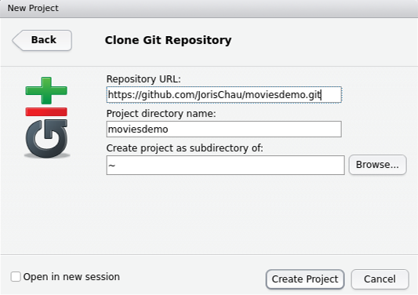

Clone existing Git repository (2)
========================================================

* In Git shell type: `git clone https://github.com/JorisChau/moviesdemo.git`
* In RStudio: `File > New Project > Existing Directory`
* Select path to cloned package on local pc

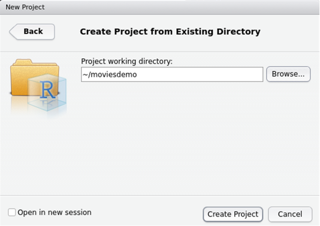

Work with existing R packages
========================================================

Published packages (21/11/17): 11.877 on CRAN and 1.476 on Bioconductor

### Install and load an R package

```r
# ------- INSTALL ---------------
install.packages("x")
# or
source("https://bioconductor.org/biocLite.R")
biocLite("x")
# or
install_github("x")

# ------- LOAD and ATTACH -------
library("x")
```

&nbsp;

### Examples of packages

* https://github.com/ManonMartin/MBXUCL
* https://cran.r-project.org/web/packages/pdSpecEst/


 5 package states
========================================================
* **source**: what we are currently working on during the package development
* **bundled**: compressed single file (`.tar.gz.`); intermediary state  (Windows/Mac) or used for Linux distribution
* **binary**: compressed single file used to distribute your package (very different internal structure); platform-specific: `.zip` (Windows), `.tgz` (Mac)
* **installed**: decompressed package into a package library (i.e. directory containing installed packages)
* **in-memory**: loaded package, required to be used

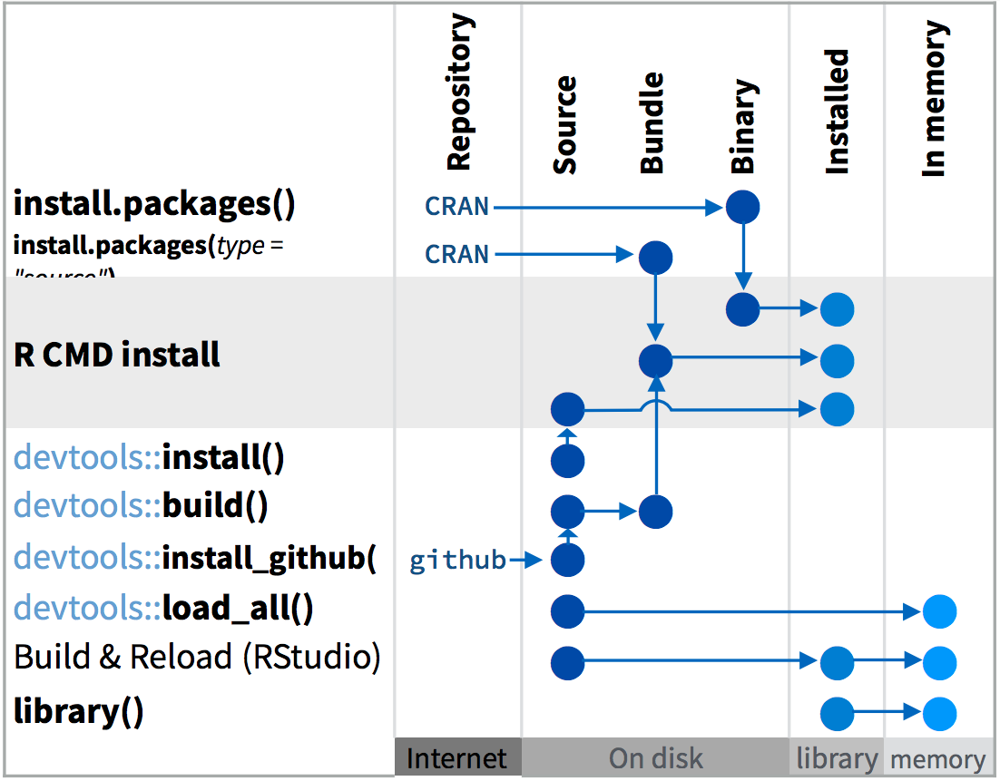
<div style="text-align: right; font-size:0.5em;" > [source: https://github.com/rstudio/cheatsheets/raw/master/package-development.pdf ] </div>


Why you should write an R package
========================================================
## PROS

### Good practices and automation are key for time-saving
* Avoid coding errors
* Functions, data and package documentation
* Conventions and tools standardisation
* Available tests and checks

### Portable code
* Easier to share your codes within your team or carry out a group work (with GitHub)
* Open your code to the R community (extra testing for bugs, meet new needs, etc.)
* Publish and value your coding work (along with your articles)
* Deploy Shiny app hosted online (with GitHub)

## CONS
* More upstream work
* must pass checks and meet the standards


The "devtools" R package
========================================================
### Motivations
*= Tools to make R packages development easier*
* Simplifies and automates common development tasks
* Encapsulated and developed in parallel with RStudio
* Incorporates the best practices of package development

&nbsp;

### Useful `devtools` functions
  * `create("path-to/package-name")`: Creates a new package skeleton
  * `load_all()`:  Loads a package in memory
  * `document()`: Uses `roxygen2` to document a package
  * `check()`: Checks and builds and  a source package
  * `build()`: Builds a source package
  * `test()`: Executes the `test_that` tests


More info: https://cran.r-project.org/web/packages/devtools/


The RStudio interface and start of a package
========================================================

### Useful RStudio facilities
* Only within a project!
* **Build** (tools for building and testing packages) and **Git** (Git and GitHub version control system) **tabs**

### Package creation workflow
* `File > New Project > New Directory > R package`  (or  `devtools::create()`)

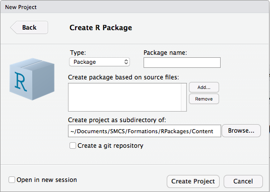


* Set the package name and the project directory
* Select source files (= R scripts) (optionnal)
* Create a git repository (optionnal)

**Note**: The choice of the name is important for your package visibility!! Name it with letters, numbers and periods only. It must start with a letter and cannot end with a period.

Package structure
========================================================

&nbsp;
&nbsp;


<div style="text-align: right">
(not exhausitive) </div>

<div style="text-align: right; font-size:0.5em;" > [source: https://github.com/rstudio/cheatsheets/raw/master/package-development.pdf ] </div>


The .Rbuildignore file
========================================================

### Motivation
Files from the *source* package appearing in `.Rbuildignore` are not included in the *bundled* package

### Best practice
Use `devtools::use_build_ignore("files")` to generate the regular expression in the `.Rbuildignore` file matching the exact file(s) to be excluded

### Excerpt from .Rbuildignore


```r
^.*\.Rproj$       # R project file
^\.Rproj\.user$   # temporary files
^README\.Rmd$     # README.Rmd
^README-.*\.png$  #
^\.travis\.yml$   # Travis test
```


DESCRIPTION (1)
========================================================

## Motivation

Mandatory DCF file that stores the package metadata. Specifies dependencies, who can use it (license) and whom to contact in case of problems, etc.


## Structure and  main fields

<div class="sourceCode"><pre class="sourceCode yaml"><code class="sourceCode yaml"><span class="fu"><font color="#8A0868">fieldName: </font></span>value</code></pre></div>

* `Title`:  One line description of the package
* `Description` : Multiple sentences short description of the package

* `Authors@R` : Package *Authors* (`"aut"`), Creator and package *Maintainer* (`"cre"`), Contributors (`"ctb"`), etc. Comprehensive code list: http://www.loc.gov/marc/relators/relaterm.html

* `Version` :
  + Released version: `<major>.<minor>.<patch>`
  + In-development package: add a 4th component, starts at 0.0.0.9000

* `License` : Important for the package release. Explain who and how to use the package (e.g. GPL-3)
A `LICENSE` file can be added for more information.

* `LazyData` : If `TRUE`, the datasets are lazily loaded


DESCRIPTION (2)
========================================================

### Excerpt from moviesdemo/DESCRIPION

<div class="sourceCode"><pre class="sourceCode yaml"><code class="sourceCode yaml"><span class="fu"><font color="#8A0868">Package: </font></span>moviesdemo
<span class="fu"><font color="#8A0868">Type: </font></span>What the Package Does (Title Case)
<span class="fu"><font color="#8A0868">Version: </font></span>0.0.0.9000
<span class="fu"><font color="#8A0868">Authors@R: </font></span>c(
    person("Joris", "Chau", email = "j.chau@uclouvain.be", role = c("aut", "cre")),
    person("Manon", "Martin", email = "manon.martin@uclouvain.be", role = "aut"))
<span class="fu"><font color="#8A0868">Description: </font></span>More about what it does (maybe more than one line)
    Use four spaces when indenting paragraphs within the Description.
<span class="fu"><font color="#8A0868">License: </font></span>CC0
<span class="fu"><font color="#8A0868">URL: </font></span>https://github.com/JorisChau/moviesdemo
<span class="fu"><font color="#8A0868">Encoding: </font></span>UTF-8
<span class="fu"><font color="#8A0868">Depends: </font></span>R (>= 3.3.1)
<span class="fu"><font color="#8A0868">LazyData: </font></span>true
<span class="fu"><font color="#8A0868">Imports: </font></span>shiny
<span class="fu"><font color="#8A0868">RoxygenNote: </font></span>6.0.1
<span class="fu"><font color="#8A0868">Suggests: </font></span>
    knitr,
    rmarkdown,
    testthat
<span class="fu"><font color="#8A0868">VignetteBuilder: </font></span>knitr
</code></pre></div>


Dependencies in DESCRIPTION
========================================================
Comma separated list of needed package names

* <code class="sourceCode yaml"><span class="fu"><font color="#8A0868">Imports: </font></span></code>
Packages listed must be present and are installed if not.

**Tip**: ! `Imports` will only ensure that it is *installed* and will not *attach* it <br />
=> Best practice:  refer explicitly to external functions with `package::function()`.


* <code class="sourceCode yaml"><span class="fu"><font color="#8A0868">Suggests: </font></span></code>
The packages are not required for installation but can be used (e.g. for datasets, to run tests or build vignettes, specific function needing the package).

Test if a suggested package is available for a specific function `FUN`:


```r
FUN <- function(x) {
  if (!requireNamespace("suggestedPackage", quietly = TRUE)) {
    stop("suggestedPackage installation is necessary for function FUN")
  }
}
```


* <code class="sourceCode yaml"><span class="fu"><font color="#8A0868">Depends: </font></span></code> Used to require a specific version of R i.e. require a version greater than or equal to the currently used version.


**Notes:**
* Alternative setting of dependencies: namespace imports
* Versioning to specify a minimum package version: `Suggests: knitr(>=1.17)`


R scripts good practices (1)
========================================================
### Function names
Should be meaningful and end with `.R`

### Code style
* `formatR::tidy_dir()`: automatically reformats R code
* `lintr::lint_package()`: warns about potential style, syntax or semantic problems
* Check http://adv-r.had.co.nz/Style.html for conventions concerning object names, spacing, {}, comments, indentation, etc.

### Top-level code rules in the scripts

* Never use : `library()` or `require()` since packages will not be loaded and it modifies the search path; `source()` modifies the current environment

* Use carefuly (reset after use with `on.exit()`): the global `options()`,  the graphical parameter `par()`, all functions modifying default directories (e.g. `.libPaths()`, `setwd()`)

### load_all
Use `devtools::load_all()` for the R functions development workflow to avoid a re-installation

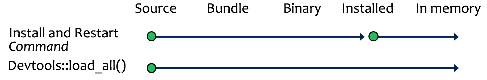


R scripts good practices (2)
========================================================
### Input arguments check


```r
FUN <- function(a, type = c("mean", "median")) {
  switch(type,
         mean = mean(a),
         median = median(a))
}
```


```r
FUN(a = c(1, 4, 6, F, 5, 2, 1) , type="mean")
```

```
# [1] 2.714286
```


```r
FUN(a = c(1, 4, 6, 5, 5, 2, 1), type="meen")
```


R scripts good practices (3)
========================================================
### Input arguments check


```r
FUN <- function(a, type = c("mean", "median")) {
   if (!is.numeric(a)) {
    warning(deparse(substitute(a)), " is not numeric")
   }
  type <- match.arg(type)
  switch(type,
         mean = mean(a),
         median = median(a))
}
```


```r
FUN(a = c(1, 4, 6, F, 5, 2, 1), type="meen")
```

```
# Error in match.arg(type): 'arg' should be one of "mean", "median"
```


```r
FUN(a = c(1, 4, 6, 5, 5, 2, 1), type="mean")
```

```
# [1] 3.428571
```


Object documentation
========================================================
### Motivations
Object documentation (available through `help()` function) acting as a dictionnary for the package, the functions and the datasets. Influences the quality of your package ; useful both for package developers and users.

Help file format (`.Rd`) with formatting commands ~ LaTeX

### Excerpt from moviesdemo/man/advise.good.movie.Rd
<div class="sourceCode"><pre class="sourceCode yaml"><code class="sourceCode yaml"><span class="fu"><font color="#8A0868">\name</font></span>{advise.good.movie}
<span class="fu"><font color="#8A0868">\alias</font></span>{advise.good.movie}
<span class="fu"><font color="#8A0868">\title</font></span>{Advise movies based on another movie}
<span class="fu"><font color="#8A0868">\usage</font></span>{advise.good.movie(similar_to, how_many, draw_scores = FALSE, ...)
}
<span class="fu"><font color="#8A0868">\arguments</font></span>{
<span class="fu"><font color="#8A0868">\item</font></span>{similar_to}{character, movie title from the database.}
<span class="fu"><font color="#8A0868">\item</font></span>{how_many}{integer, how many movies to advise.}
<span class="fu"><font color="#8A0868">\item</font></span>{draw_scores}{if <font color="#8A0868">\code</font>{TRUE}, draws a barplot with the similarity scores.}
<span class="fu"><font color="#8A0868">\item</font></span>{...}{additional arguments.}
}
<span class="fu"><font color="#8A0868">\value</font></span>{A list with the following elements:
<span class="fu"><font color="#8A0868">\describe</font></span>{
  <span class="fu"><font color="#8A0868">\item</font></span>{<font color="#8A0868">\code</font>{selected}}{movie title used to advise other movies}
  ...
}
<span class="fu"><font color="#8A0868">\description</font></span>{
Documentation...
}
</code></pre></div>

Writing function help files with Roxygen2 (1)
========================================================

### Motivations
Easier documentation generation: (1) simplified format (+ .Rd syntax) ; (2) the code and documentation are in a same file => both are updated at the same time ; (3) partly automatically generated by Roxygen, avoiding manual errors.


### Workflow
* Install the package `roxygen2`
* Write Roxygen comments (starting with `#'`) within your `.R` files
* Run `devtools::document()` to translate your Roxygen comments into a `.Rd` file and update the NAMESPACE (seen later)
* Preview the documentation (`Preview` button within the `.Rd` file or build and `help()`) and modify/update/correct your comments to improve the documentation

### Structure
* Introduction block (Mandatory) is text without tag (first sentence: title ; 2nd paragraph: description)
* Other blocks with tags (main ones):
  + `@param name description`: describes function parameters
  + `@examples`: executable R script applying the function, use `\dontrun{}` to avoid errors check
  + `@return`: describes the outputs of the function
  + `@export` and `@import` (or `@importFrom`): specifies NAMESPACE imports/exports


Writing function help files with Roxygen2 (2)
========================================================
### Excerpt from moviesdemo/R/advise.R

```r
#' Advise movies based on another movie
#'
#' \code{advise.good.movie} takes as input a movie from the movie database and gives as #' output a number of movies that are similar.
#'
#' @param similar_to character, movie title from the database.
#' @param how_many integer, how many movies to advise.
#' @param draw_scores if \code{TRUE}, draws a barplot with the similarity scores.
#' @param ... additional arguments.
#'
#' @return A list with the following elements:
#' \describe{
#'   \item{\code{selected}}{movie title used to advise other movies}
#'   \item{\code{to_watch}}{advised movie title(s)}
#'   \item{\code{movie_ids}}{line number in the \code{movies} database of the advised movie(s)}
#'   \item{\code{scores}}{similarity scores of the advised movie(s)}
#' }
#'
#' @import graphics
#' @export

advise.good.movie <- function(similar_to, how_many, ...){
# ---- advise.good.movie function body ----
  }
```

Package documentation
========================================================

### Package documentation
* Roxygen package documentation (usually contained in `<package-name>.R`). Documentation accessed via `help()`  or `package?`
* Use the `@docType package` tag

&nbsp;

### Other documentations

* Vignette(s) (seen later)

* `README.Rmd` with the following suggested structure (from Hadley Wickham):
  1. Describe the high-level purpose of the package
  2. An example where the package is applied
  3. Installation instructions
  4. Overview of the main components of the package (a Vignette is more exhaustive!)


Create the pdf reference manual
========================================================

In order to create a pdf reference manual from the documentation (`.Rd`) files, you can run in R:


```r
system("R CMD Rd2pdf /path/to/package_root")
```
**Tip**: use `.` as your `/path/to/package_root` while working within your R package project

**Note**: if you submit your package to CRAN, the reference manual is created automatically by CRAN, (e.g. https://cran.r-project.org/web/packages/pdSpecEst/pdSpecEst.pdf)


NAMESPACE*
========================================================

### Motivating example

```r
nrow
```

```
# function (x) 
# dim(x)[1L]
# <bytecode: 0x564e96a8c6c8>
# <environment: namespace:base>
```

Now what happens if we overwrite `dim()` in the global environment?


```r
dim <- function(x) c(1, 1)
dim(mtcars)
```

```
# [1] 1 1
```

Does `nrow()` still work?


```r
nrow(mtcars)
```

```
# [1] 32
```

NAMESPACE
=========================================================

### Motivation
The NAMESPACE file decides which functions/objects to **import** from other packages and which functions/objects to **export** from the created package.

We write **imports** and **exports** through Roxygen comments in our `.R` files.

### Several useful Roxygen comments
* `#' @export`, exports functions
* `#' @importFrom`, imports speficic functions, e.g. ``#' @importFrom utils browseURL`
* `#' @import`, imports all functions in a package, e.g. `#' @import shiny`
* See http://r-pkgs.had.co.nz/namespace.html for more details <br>
<br>

### Workflow
1. Add Roxygen comments to `.R` files
2. Run `devtools::document()` (or `Ctrl/Cmd + Shift + D` in RStudio) to Roxygenize files
3. Repeat until correct functions are imported and exported

NAMESPACE
=========================================================

**Tip**: Roxygenize also on `Build and Reload` (`Ctrl/Cmd + Shift + B` in RStudio)

* In RStudio: `Build > Configure Build Tools > Build Tools`

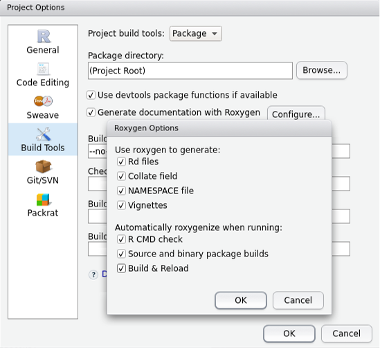


Data
========================================================

### Including data in the package
* Exported data available to the user is stored in `data/`.
* Internal data *not* available to the user is stored in `R/sysdata.rda`
* Raw data can be stored in `inst/extdata`

### Exported/Internal data

```r
# setwd(/path/to/package_root)
x <- sample(1000)
devtools::use_data(x) ## exported data, writes x to data/x.rda
devtools::use_data(x, internal = T) ## internal data, writes x to R/sysdata.rda
rm(x)
load("data/x.rda")
load("R/sysdata.rda")
```

**Tip**: set `LazyData:true` in `DESCRIPTION` file, (datasets do not occupy memory until used).

### Documenting datasets

Objects in `data/` are always exported and therefore *need* documentation. Documenting data is (almost) the same as documenting a function. Document the name of the dataset and save it in `R/`, e.g. `R/data.R`. See http://r-pkgs.had.co.nz/data.html for more details and how to include other types of data.

Data
========================================================

### Excerpt from `R/data.R`


```r
#' TMDb 4800 movie dataset
#'
#' Metadata on 4800 movies from The Movie Database (TMDb) from the Kaggle website.
#'
#' The variables are as follows:
#'    \itemize{
#'      \item{title}{character, title of the film.}
#'      \item{genres}{string of characters, genres of the film.}
#'      \item{popularity}{numeric, popularity of the film in terms of views.}
#'      \item{vote}{numeric, voted rating of the film between 0 and 10.}
#'      \item{language}{factor, original language.}
#'      \item{producers}{string of characters, production companies.}
#'      \item{release}{date, release date of the film.}
#'      \item{runtime}{numeric, runtime in minutes.}
#'      \item{plot}{character, plot summary of the film.}
#'   }
#'
#' @format A data frame with 4800 rows and 9 variables.
#'
#' @source \url{https://www.kaggle.com/tmdb/tmdb-movie-metadata}
"movies"
```

**Note**: view the resulting help file (after documentation `Ctrl/Cmd + Shift + D`) e.g. with `?movies`.


Automated Testing
=========================================================

### Motivation
Automate tests to see if code is (still) working properly. Advantages: confidently make changes without breaking other functionalities, easier to locate bugs, etc.

### Setup

```r
# install.packages('testthat')
# setwd(/path/to/package_root)
devtools::use_testthat() ## creates necessary files/folders
```

### Test structure
* An **expectation** starts with `expect_` and describes expected result of a computation
* A **test** created with `test_that()` groups multiple expectations to test a (simple) function
* A **file** groups toghether multiple similar tests and is named via `context()`

### Workflow
* Modify code or tests
* Test package with `Ctrl/Cmd + Shift + T` or `devtools::test()` or `Build > Test Package`
* Repeat until all tests pass

Automated Testing
=========================================================

### Several useful `expect_` functions

* `expect_equal()` uses `all.equal()` for equality with some numerical error:


```r
library(testthat)
expect_equal(10, 10) ## passes
expect_equal(10, 10 + 1E-7) ## passes
expect_equal(10, 11) ## errors
```

* `expect_identical()` uses `identical()` for exact equality
* Other `expect_` functions:


```r
## Match character vectors
string <- "Testing is fun!"
expect_match(string, "Testing") ## case-sensitive

## Inspect printed output
expect_output(str(list(1:10, letters)), "List of 2")
expect_message(message("Hello"), "Hello")
expect_warning(log(-1), "NaNs produced")
expect_error(1 / "a", "non-numeric argument")
```

* See http://r-pkgs.had.co.nz/tests.html for more details and writing your own `expect_`'s

Automated Testing
=========================================================

### Excerpt from `tests > testthat > test-functions.R`


```r
context("moviesdemo functions")

test_that("Output similarity measures", {

    ## Test output sim.genres()
    expect_is(sim.genres(movies$title[1], movies$title[2]), "numeric")
    expect_equal(sim.genres(movies$title[1], movies$title[1]), 1)
    expect_error(sim.genres(NA, movies$title[1]))

})

test_that("Output advise.good.movie function", {

    out <- advise.good.movie(movies$title[1], 5, weights = rep(1,4))

    expect_output(str(out), "List of 4")
    expect_match(out[[1]], movies$title[1])
    expect_equal(length(out[[2]]), 5)
    expect_is(out[[2]], "character")
    expect_error(advise.good.movie(movies$title[1], NA),
                 "Argument 'how_many' should be a number...")

})
```

Vignettes
=========================================================

### Motivation
Vignettes are long-form tutorials written in Markdown (as this presentation). Vignettes are more detailed than function documentation. A vignette can e.g. describe how to combine different functions in the package to solve a complex problem. Example:
https://cran.r-project.org/web/packages/pdSpecEst/vignettes/depth_ranktests.html

### Setup
* Install rmarkdown and knitr packages with `install.packages(c("rmarkdown", "knitr"))`
* Install **pandoc** -> http://pandoc.org/installing.html
* Run `devtools::use_vignette("my-vignette")` creating necessary files/folders

### Workflow
* Modify the vignette
* **Knit** vignette with `Ctrl/Cmd + Shift + K` or clicking the `Knit` button

### Markdown and Knitr
**Markdown** is a simple text formatting language, not as flexible as LaTeX, but easy to write and read. **Knitr** allows to intermingle code and text by running R code and translating it into formatted Markdown. See http://r-pkgs.had.co.nz/vignettes.html for a good intro to Markdown/Knitr with RStudio.

Compiled code*
=========================================================
class: small-code

Speed up your code by including `C` or `C++` code in your package with `Rcpp` (and `RcppArmadillo` or `RcppEigen`). For more details, see e.g. http://adv-r.had.co.nz/Rcpp.html or http://r-pkgs.had.co.nz/src.html.

### To illustrate

```r
## write C++ function
Rcpp::cppFunction(depends = "RcppArmadillo", 'arma::cx_mat mExp_C(arma::cx_mat A) {
  arma::cx_mat A_exp = arma::expmat(A);
  return A_exp;
}')

## write R function
mExp_R <- function(A){
  e <- eigen(A)
  e$vectors %*% diag(exp(e$values)) %*% solve(e$vectors)
}

## Computation times
A <- matrix(complex(real = rnorm(4), imaginary = rnorm(4)), nrow = 2)
microbenchmark::microbenchmark(mExp_R(A), mExp_C(A))
```

```
# Unit: microseconds
#       expr     min       lq      mean   median       uq      max neval
#  mExp_R(A) 263.449 334.2225 403.59373 339.4565 345.5160 4317.260   100
#  mExp_C(A)  17.425  28.5715  42.53251  32.3480  35.5825 1050.405   100
```

Git and GitHub
=========================================================

### Motivation
**Git** is a version control system that tracks changes in your code and allows to undo mistakes. **GitHub** is a website where you can share code and work together with others via e.g. pull requests, branches, ...

* Installing an R-package from GitHub is (very) easy:


```r
devtools::install_github("JorisChau/moviesdemo")
```

### Set up Git/GitHub with RStudio
* Install Git
* In a Git shell, configure username and email, (check with `git config --global --list`)

```r
git config --global user.name "YOUR FULL NAME"
git config --global user.email "YOUR EMAIL ADDRESS"
```
* Create a GitHub account on https://github.com (use the same email as above)
* If needed, generate a SSH key, see http://r-pkgs.had.co.nz/git.html for details
* In RStudio project: `Tools > Project Options > Git/SVN` change Version Control System to `Git`
* In a Git shell, run `git init` and restart RStudio ...

Git and GitHub
=========================================================

* New **Git** pane tracks changes in the code:

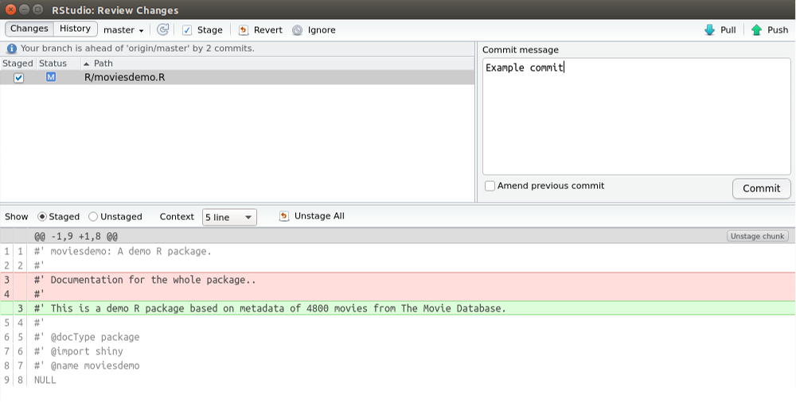

Git and GitHub
=========================================================

### To create a new commit (often)

* Save changes and open `commit` window in Git pane
* Stage (select) files for inclusion in commit
* Write a (meaningful) commit message and commit

**Tip**: Add files you do not want to include to `.gitignore` (e.g. temporary folders or large files).

### Undo mistakes
* Roll back changes to previous commit by clicking on `More > Revert` (cannot undo!)
* You can also undo changes to part of a file or individual lines or changes that occured before the last commit, see e.g. http://r-pkgs.had.co.nz/git.html for more details

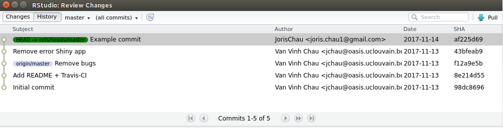

Git and GitHub
=========================================================

### Setup remote repo GitHub
* Create a new repo on Github: https://github.com/new with the same name as the package and package title as repo description
* Follow instructions from GitHub, similar to (Git shell):

```r
git remote add origin https://github.com/JorisChau/moviesdemo.git
git push -u origin master
```
(First line assigns remote repo to `origin`. Second line **pushes** (publishes) local repo `master` to remote repo `origin`).

### Synchronizing with GitHub
* Commit locally until ready to push
* Press **Push** in Git pane
* Go to GitHub page and verify modifications

Go to, for instance, http://r-pkgs.had.co.nz/git.html to learn how to work together with others using Git + GitHub (e.g. *branches*, *pull requests*, *tracking issues*, etc.).

Checking package
=========================================================

### Workflow
* Run `devtools::check()` or press `Ctrl/Cmd + Shift + E`
* Fix errors/warnings/notes
* Repeat until there are no more errors/warnings/notes

### Check messages
* **ERROR**: severe problem that needs to be fixed in any case
* **WARNING**: problems that must be fixed if you want to submit to CRAN (or Bioconductor)
* **NOTE**: mild problems, if you submit to CRAN try to eleminate all notes, if not explain why the note is not a problem in CRAN submission comments.

### Example output `devtools::check()`
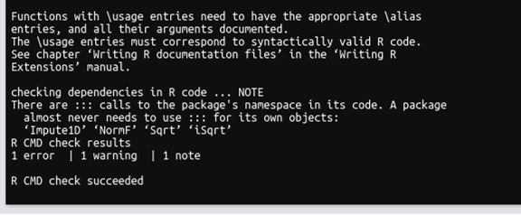

Checking package and Release
=========================================================

To release package on CRAN, the package need to build (without errors/warnings) on all major platforms. If you do not have access to different operating systems yourself:

* Check on Windows with win-builder https://win-builder.r-project.org/
* Check on Linux/OS X with Travis

### Setup Travis
* Run `devtools::use_travis()` to set up basic `travis.yaml` configuration

```r
## Example travis.yaml config file
language: R
warnings_are_errors: false
sudo: false
cache: packages
os:
  - linux
  - osx
notifications:
  email: false
```
* Go to https://travis-ci.org/ and enable Travis for repo you want to test
* Push to GitHub and check build results on Travis website

Checking package and Release
=========================================================

### Example output Travis (linux, osx)

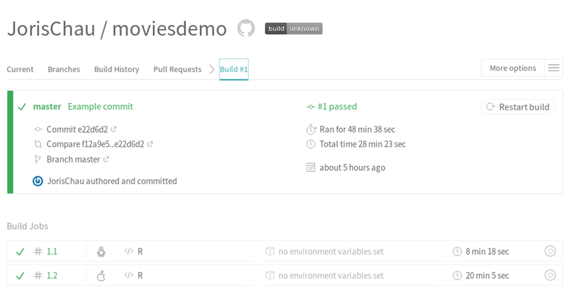

Checking package and Release
=========================================================

### CRAN Release
* Verify that the package passes `devtools::check()` on the major platforms (windows, linux, osx) and you adhere to CRAN policies
* Change the version number in `DESCRIPTION` and update `README.md`, `NEWS.md`, `cran-comments.md`
* Be aware of backward compatibility, see http://r-pkgs.had.co.nz/release.html
* Submit to CRAN with `devtools::release()`

After acceptance CRAN builds binary packages for each platform (may uncover further errors).
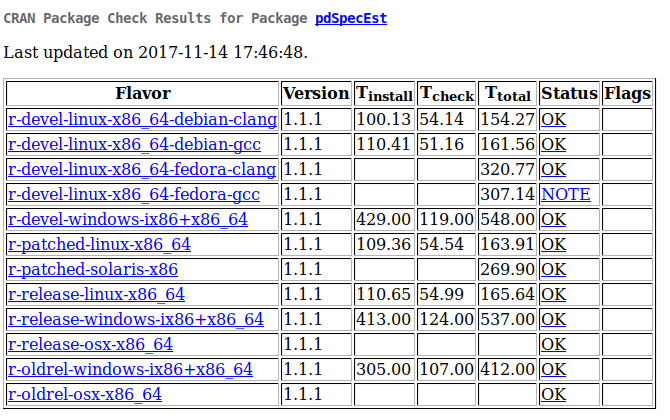

Shiny applications
=========================================================
class: small-code

### Motivation
In addition to vignettes, it may be useful (not always) to interactively demonstrate the package functionalities with an R shiny application, e.g. http://jchau.shinyapps.io/moviesdemo

### Host Shiny app online

* Publish Shiny app to public server (e.g. http://shinyapps.io) via the `Deploy App` button
* Deployed Shiny app can fetch R packages from CRAN or GitHub
* Include link in `README.md` or `DESCRIPTION` file

### Include Shiny app in package

* add `Imports: shiny` to `DESCRIPTION` file
* Place Shiny app in `inst/shiny-examples/myapp/` and add `runapp.R` to `R/`
* Run app from within R via `moviesdemo::runMovieApp()`. Excerpt from `runapp.R`:


```r
runMovieApp <- function() {
  appDir <- system.file("shiny-examples", "myapp", package = "moviesdemo")
  if (appDir == ""){
    stop("Could not find example directory. Try re-installing `moviesdemo`.", call. = FALSE)
  }
  shiny::runApp(appDir, display.mode = "normal")
}
```


Now it is your turn!
=========================================================

### Start creating an R package from scratch

Using either your own R functions or the `moviesdemo` source files (.R and .rda)

* It should contain at a minimum:
  + a `DESCRIPTION` file
  + R scripts with Roxygen comments
  + exported or internal data in `.rda` format

* Roxygen comments should include at least one package dependency (import) and an executable example.

* Generate the documentation and update your `NAMESPACE`
* Check and build your package

* Extra steps: include vignettes, tests, generate the pdf manual, add a README.Rmd, ...

&nbsp;

###  Or work on your own *in process* package


